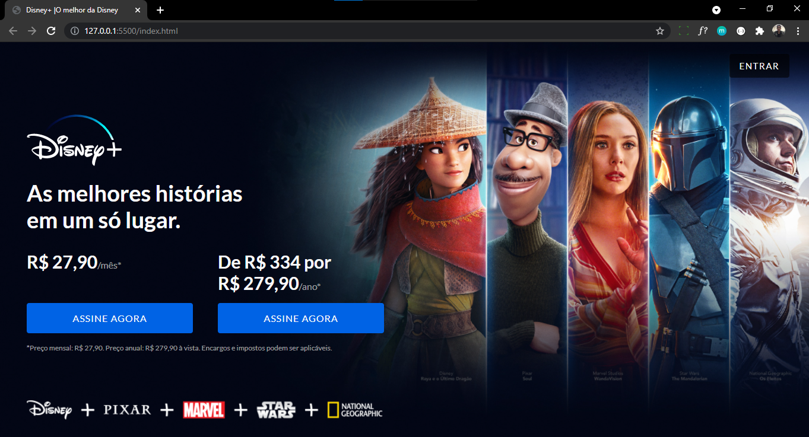
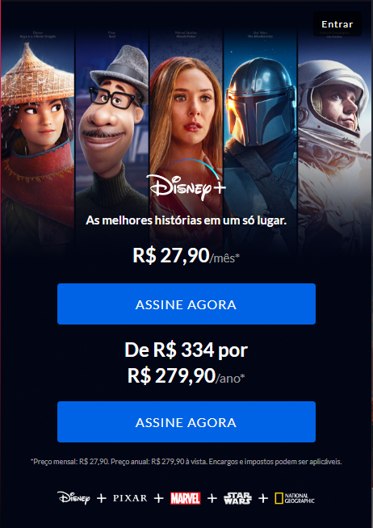

# Clone da Landing Page do Disney+

Este clone teve como objetivo aprimorar meus conhecimentos em CSS e responsividade.
O estudo foi feito seguindo como base, um tutorial do canal [Tiger Codes](https://www.youtube.com/watch?v=o1YqbtSoPjs), e a responsividade foi feita utilizando de diversos conhecimentos adquiridos em pesquisas pela internet sobre o assunto.

------------

### Versão Desktop

### Versão Mobile

